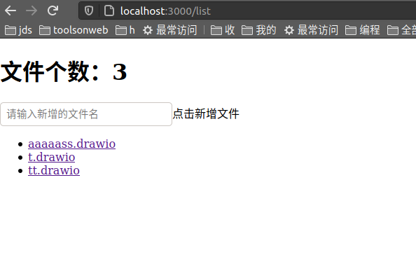
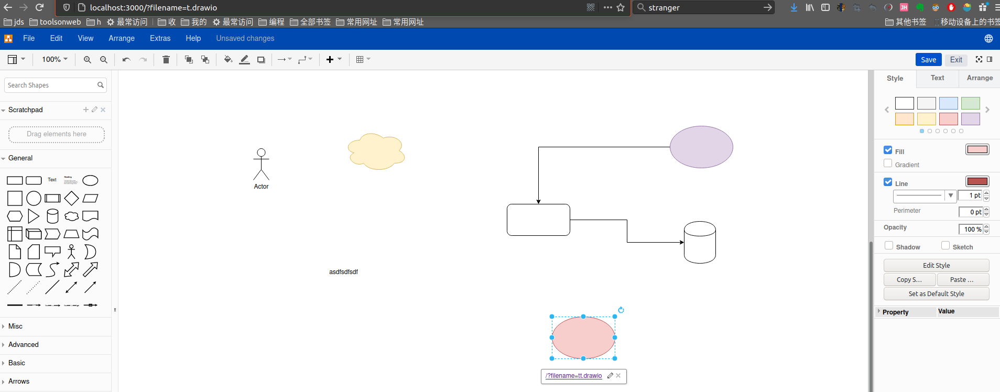

# my-drawio

自定义存储drawio编辑器存储文件

目前实现
- /list 页面列举文件夹下的drawio文件
- get /?filename=x.drawio 获取x.drawio的图片显示在页面，点击图片进入drawio编辑器iframe
- put /?filename=x.drawio 保存drawio编辑器
- 存储到minio

待实现
- 存储到dzzoffice
- 存储到nextcloud

## TODO

- [ ] 增加内网部署 draw.io
- [ ] 存储到webdav

## DEMO  

**使用docker-compose**

`
docker-compose up
`  
该命令会开启三个服务：
> drawio 3000端口 links引用以下两个服务  
>> minio 9000端口  
>> drawioservice 8090：8080端口  

首先访问 `http://127.0.0.1:9000` 进入minio,使用docker-compose.yml配置的MINIO_ROOT_USER和MINIO_ROOT_PASSWORD登陆minio,创建test bucket  
### 看不了图去[码云](https://gitee.com/timsengit/my-drawio.git)
然后访问 `http://127.0.0.1:3000/list` 进入列表页面

输入新文件名可新增文件，点击已存在文件可直接跳转至预览页面

点击预览页面，进入编辑页面,点击保存返回预览页面

